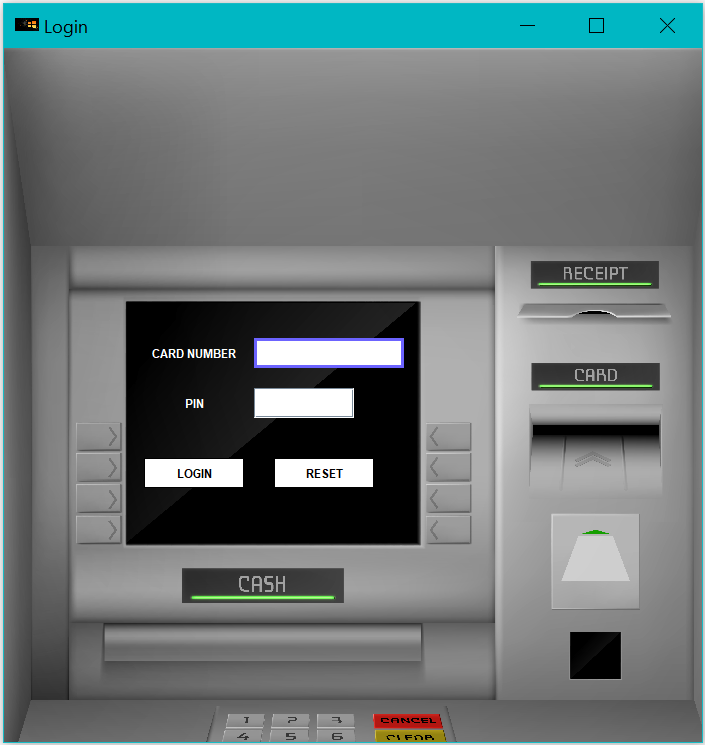

# ATM-Machine

This project is a **Simulation of an ATM Banking System** implemented in **Java**.

Front end is implemented using AWT and Swing. Data is fetched from the oracle database using JDBC.

## Functionality
➢ The system has a verification process for which the clients are required to login with their ATM card number and a pin.

➢ Authorization to the account is not provided with an invalid pin or an invalid card number. 

➢ Once the user is logged in, the user is provided with various banking services like **Cash Withdrawal, Deposit Cash, Balance Inquiry, Transferring Funds and View Transfer History**.

➢ The Withdraw Cash feature enables the client to withdraw cash from their bank account. 

➢ The Deposit Cash feature enables the client to Deposit money to their bank account. 

➢ The Transfer Funds feature enables the client to transfer funds to other accounts. 

➢ A special function is included where the client can view his/her transfer history. 

➢ The client can also check their account balance at the ATM.

➢ All the above functionalities were implemented with neccassary validations in the database.

## Front End Screenshots

| Login | Services Menu |
:-------------------------:|:-------------------------:
 | 

| Withdraw Window | Balance Inquiry |
:-------------------------:|:-------------------------:
 | 

| Transfer Funds Window | Transfer History |
:-------------------------:|:-------------------------:
 | 

| Deposit Window | Logout |
:-------------------------:|:-------------------------:
 | 
